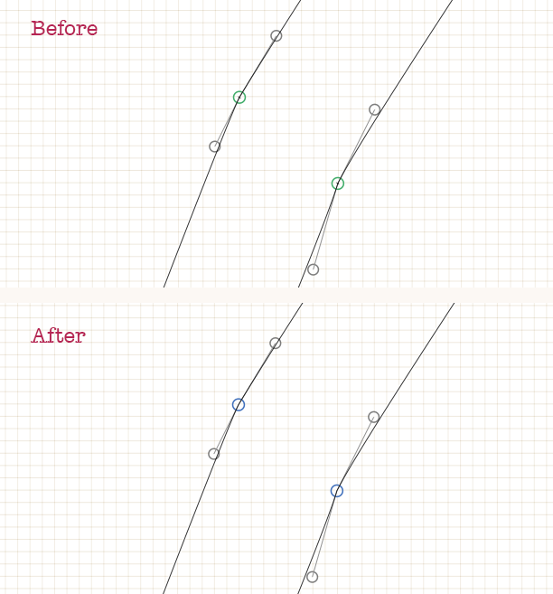

Glyphs-Scripts
==============
## AddAnchorstoGlpyhs.py
Using a dictionary the script adds anchors to all the master of the selected glyphs.
Feel free to edit the dictionary to match your scheme of anchors.
For those glyphs that are not in the dictionary the script do nothing.
There is also another dictionary with the position of the anchors.
### How to use:
Run on glyph edit window or select various glyphs and run.

### Notes:
This script is heavly based on Ohbendy's Place anchors in all masters script.
https://github.com/ohbendy/Python-scripts-for-Glyphs

Thanks to Mark Frömberg (mirque.de) for the angle function.

#### AnchorDictionary.py
Use this complementarty script to create a dictionary based on a previous font.
Outputs to the console

## RedCircles.py

This script searches for control points that are overlapping nodes and marks them with an annotation circle, setting also glyph's color to red.
###How to use:
Select the glyphs and run the script. It works for one master at a time.
###Note:
An advanced and much better tool to perform this is RedArrows by Jens Kutilek (https://github.com/jenskutilek/RedArrow-Glyphs) but it only works on Glpyhs 2.

## Smooth2Sharp.py

The script searches smooth nodes with disaligned handles and changes them to sharp. Maybe useful for auto–vectorized illustrations.

###How to use:
Run on glyph edit window or select various glyphs and run.

