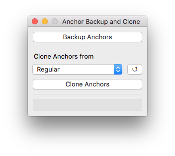
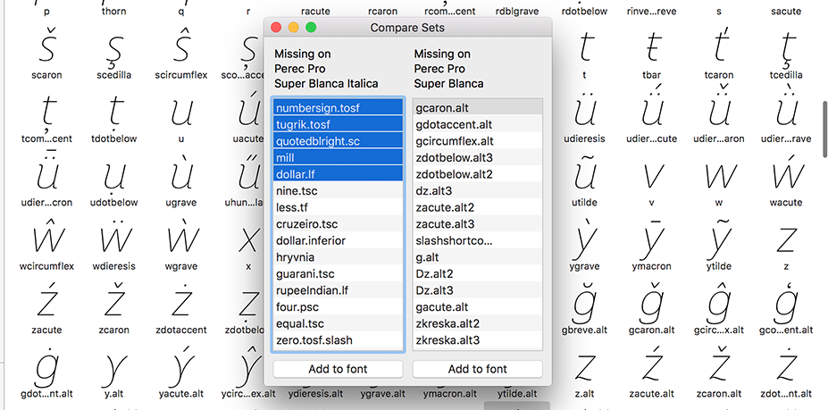
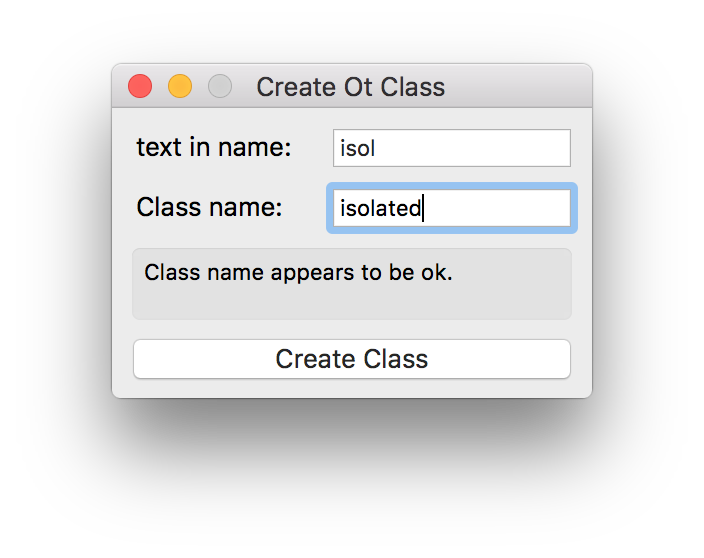
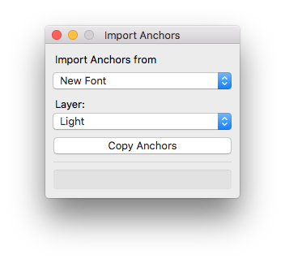
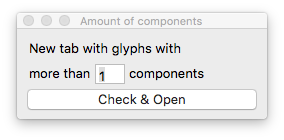
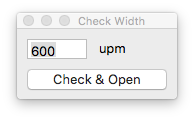
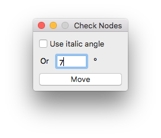

Glyphs-Scripts
==============
Python scripts for the font editor Glyphs App.
Please feel free to report bugs and send suggestions.

#### addAnchorstoGlpyhs.py
Using prebuilt dictionary the script adds anchors to all the master of the selected glyphs.
Feel free to edit the dictionary to match your scheme of anchors.
For those glyphs that are not in the dictionary the script do nothing.
The position of the anchors are estimated, inside the script there is another dictionary with the position of the anchors.

—Thanks to Mark Frömberg (mirque.de) for the angle function.

---

#### addGuidelineName.py
(UI) Allows to add name to guideline (¿hidden feature in Glyphs?)

---

#### addNamesToStylisticSets.py
Based on a given list adds descriptive names to stylistic sets. (You have to edit the list inside the script)

---

#### anchorBackupAndClone.py
(UI) Backup anchors to a secondary layer and allows to copy them to another layer.

---

#### anchorDictionary.py
Use this complementarty script to create a dictionary based on a previous font.
Outputs to the console.

---

#### automaticOTclasses.py

Create and update Opentype classes based on information (name of class and text in glpyh name) stored in the custom parameter "otFeatureClass".
Useful for update continuously growing classes during the development. Also,  can create OT class based on another class finding and replacing a value.

Examples of custom parameters:

Property: `otClass`
Value: `new_class_name;text_in_glyphname;`
Example: Using `ss01;alt1;` as value will create a class named "ss01" containing all glyphs with the text "alt1" in its name.

Property: `otClassCopyEdit`
Value: `new_class_name;base_class_name;find_text;replace_text;`
Example: Using `ss02;ss01;alt1;alt2;` will findcreate a class named "ss02" based on "ss01" class replacing the text "alt1" for "alt2".

---

#### centerAnchors.py
Center all anchors of all layers of selected glyphs.

---

#### closeAllTabs.py
Close all open tabs in the document.

---

#### compareSets.py
(UI) Compares glyph sets between two open fonts and allows to add missing glyph to the other font.

---

#### copyAnchorsFromBase.py
On a suffixed glyph run the script to copy the anchors from the default version. (i.e. run on /a.ss01 and get /a anchors).

---

#### createAccentedVersions.py

Based on a dictionary stored inside the script outputs to the console the accented versions of the selected glyph. Useful for create accented versions of suffixed glyphs (i.e. run on /a.ss01 and get aacute.ss01, abreve.ss01...). Edit the dictionary to match your set.

---

#### createOTClass.py
(UI) Create an Opentype Class with glyphs containing an specified text.
—This script uses code from Mekkablue's "Make OT class from selected glyphs".

---

#### deleteNotes.py
Delete annotations in selected glyphs

---

#### importAnchors.py
(UI) Import anchors from antother font or another layer of the same font.

---

#### insertImagesToBackground.py
In the dialog box select images to insert as background. Images must be named with the corresponding glyphname (ie. a.jpg) in case the glyph is not in the font the script will create it.

---

#### markZeroHandles.py
Searches for handles that are overlapping nodes and marks them with an annotation circle, setting also the layer label color to orange.

---

#### newTabModifiedGlyphs.py
(UI) Opens in a new tab modified glyphs after or before certain date.

---

#### newTabMoreThanXComponents.py
(UI) Based on selected glyphs, opens in a new tab the glyphs with more than the indicated ammout of components.

---

#### newTabWithNotMonoGlyphs.py
(UI) Opens a newtab with those glyphs that doesn’t match with the indicated glyph width. Useful for checking monospaced fonts or tabular glyphs.

---

#### nodesNearAlignmentZones.py

(UI) Based on a upm “threshold” slider, adds circle annotation to nodes that are close to alignment zones. Useful for misplaced nodes that affects hinting.

---

#### reportAnchorsnOffMetrics.py

Prints to the console a list with the anchors off the metrics of the selected glyphs.
_This script is a modification of a mekkablue's script._

---

#### reportGlyphAnchors.py

Prints to the console the anchors used on selected Glyphs. 

---

#### slantAnchors.py

(UI) Moves anchors according to master italic angle. Useful when importing anchors from roman versions, or after changing the font angle.

---

#### smooth2Sharp.py

The script searches smooth nodes with disaligned handles and changes them to sharp. Maybe useful for auto traced illustrations.

